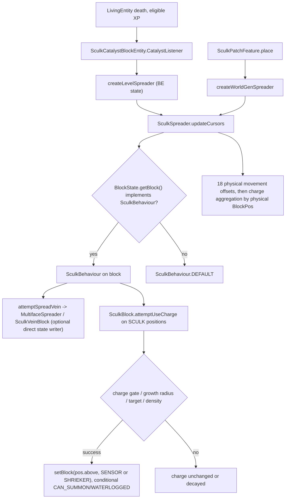

# Stage 3A-9.1 — original NeoForge SculkBlock owner declarations and complete source charge-growth dispatch

**2026-10-10 · Planetary branch `2.0` · Minecraft 1.21.1 / NeoForge 21.1.215 / Java 21.**

**Scope:** ONE originally registered concrete class `net.minecraft.world.level.block.SculkBlock`, one BLOCK ID `minecraft:sculk`. Independent source+original compiled **declaration-owner** review, not bytecode patch verification or Minecraft gameplay acceptance. This document is Stage 3A-9.1 only; original ITEM creator / complete separate creation-path audit remains Stage 3A-9.2, the six-face test contract remains 9.3, full roster recheck 9.4. Dependency-owner inspection does not re-promote already reviewed classes.

## 1. Original immutable NeoForge 21.1.215 registry and exact declaring-owner record

Original unmodified Actions [run 37988064055](https://github.com/Abbygree11/Planetary/actions/runs/37988064055) artifact **11643813158** from `aa39572950a15403ea0a9003eefccf3bf6675ff7` was independently reopened **as ZIP bytes**, not reconstructed from the previous documentation. `zipfile.ZipFile` / `csv.DictReader(delimiter='\t')` parsed `phase2-neo1211-block-registry.tsv` and property records. ZIP SHA-256 **MATCH**: `7937deee9221c2032a634d8355b8118b47efd9d905b2bb64152148c0174d090e`.

The complete original registry still contains **1060 BLOCK ID rows / 241 concrete implementation classes**, with 1333 original ITEM rows and 1712 property records. Filter **exact full class** `net.minecraft.world.level.block.SculkBlock`:

| Source field | Exact original value |
|---|---|
| `registry_id` | `minecraft:sculk`, **exactly 1 matching BLOCK** |
| `java_class` | `net.minecraft.world.level.block.SculkBlock` |
| `class_hierarchy` | `SculkBlock > DropExperienceBlock > Block > BlockBehaviour` |
| `has_orientation_candidate` | `false` |
| `declared_property_names` | **empty** — no BlockState property on sculk (not even WATERLOGGED) |
| `audit_disposition` in immutable original ZIP | `NON_PROPERTY_PATH_REVIEW_PENDING` — historical original census state, NOT an automatically rewritten artifact |
| SHA-256 of exact original tab-delimited BLOCK TSV row, in header order with a final newline | `a8d4090da59b0321961a18af0e8926f5c7e4b3cdbafcc1f5570ad608977b9639` |

A **full-signature**, not name-only parse of original `effective_method_owners` extracted exactly one declared owner for each of the following five source-census slots:

| Original full argument signature | Nearest actual declaring owner |
|---|---|
| `getStateForPlacement(net.minecraft.world.item.context.BlockPlaceContext)` | **Block** |
| `canSurvive(net.minecraft.world.level.block.state.BlockState,net.minecraft.world.level.LevelReader,net.minecraft.core.BlockPos)` | **BlockBehaviour** |
| `updateShape(net.minecraft.world.level.block.state.BlockState,net.minecraft.core.Direction,net.minecraft.world.level.block.state.BlockState,net.minecraft.world.level.LevelAccessor,net.minecraft.core.BlockPos,net.minecraft.core.BlockPos)` | **BlockBehaviour** |
| `randomTick(net.minecraft.world.level.block.state.BlockState,net.minecraft.server.level.ServerLevel,net.minecraft.core.BlockPos,net.minecraft.util.RandomSource)` | **BlockBehaviour** |
| `setPlacedBy(net.minecraft.world.level.Level,net.minecraft.core.BlockPos,net.minecraft.world.level.block.state.BlockState,net.minecraft.world.entity.LivingEntity,net.minecraft.world.item.ItemStack)` | **Block** |

Additional original compiled declaration owners (NOT substitutes for these five): `neighborChanged`, `onPlace`, `canBeReplaced(BlockPlaceContext/Fluid)`, `rotate`, `mirror`, `useItemOn`, `useWithoutItem`, `getShape`, `getCollisionShape`, `getFluidState` and scheduled `tick` all resolve to **BlockBehaviour** in the original census. The present five-owner tuple says **nothing** about custom `SculkBehaviour.attemptUseCharge`, `getRandomGrowthState` or `SculkSpreader`: their declaration/dispatch comes from the comparative source graph below.

## 2. Actual 1.21.1 Java class and inheritance

Pinned comparative readable 1.21.1 source revision [`b77c5c6995874f6cf2755bc5234428906b337b75`](https://github.com/hackersense/OptiFine-Source/tree/b77c5c6995874f6cf2755bc5234428906b337b75/1.21.1), **not verified identical to NeoForge patched method bodies**.

[`Blocks.SCULK` registration](https://github.com/hackersense/OptiFine-Source/blob/b77c5c6995874f6cf2755bc5234428906b337b75/1.21.1/net/minecraft/world/level/block/Blocks.java#L6777-L6780) instantiates `new SculkBlock` with ordinary solid block properties, map color BLACK, strength 0.2 and SCULK sound; it does **not** register random ticks or a BE. The class [`SculkBlock`](https://github.com/hackersense/OptiFine-Source/blob/b77c5c6995874f6cf2755bc5234428906b337b75/1.21.1/net/minecraft/world/level/block/SculkBlock.java#L15-L29) extends `DropExperienceBlock` and implements `SculkBehaviour`. Its constructor passes `ConstantInt.of(1)` to [`DropExperienceBlock`](https://github.com/hackersense/OptiFine-Source/blob/b77c5c6995874f6cf2755bc5234428906b337b75/1.21.1/net/minecraft/world/level/block/DropExperienceBlock.java#L13-L42); the inherited `spawnAfterBreak` can drop **1 XP** if the caller's `dropExperience` flag allows it. This destruction behavior is unrelated to the live catalyst `ENTITY_DIE` charge conversion: destroying sculk itself doesn't automatically invoke the catalyst death pipeline.

The **only class-specific state/writer dispatches** in SculkBlock's source are: `codec()` (simpleCodec); `attemptUseCharge(cursor, level, origin, random, spreader, spreadFlag)` (overrides interface requirement); private static `getDecayPenalty`; private `getRandomGrowthState`; private static `canPlaceGrowth`; and `canChangeBlockStateOnSpread() -> false`. It does **not** own `getStateForPlacement`, `canSurvive`, `updateShape`, `neighborChanged`, `randomTick`, `setPlacedBy`, scheduled `tick`, `getFluidState` or render/shape overrides. **No SculkBlock BE/ticker/listener and no SculkBlock-owned WATERLOGGED property**: the SENSOR/SHRIEKER *created by sculk* are different registered blocks with their own states and BEs.

Inherited [`SculkBehaviour` defaults](https://github.com/hackersense/OptiFine-Source/blob/b77c5c6995874f6cf2755bc5234428906b337b75/1.21.1/net/minecraft/world/level/block/SculkBehaviour.java#L55-L86) on SculkBlock:
- `attemptSpreadVein` delegates to the SculkVein `MultifaceSpreader` `spreadAll`, and **may mutate world state**; this is **not** its `attemptUseCharge` override.
- `getSculkSpreadDelay()` defaults to 1; `onDischarged()` is a no-op; `depositCharge()` defaults false; `updateDecayDelay(int)` defaults to 1.
- Crucially, `SculkBlock.canChangeBlockStateOnSpread()` returns **false**, so the `ChargeCursor.update` call path **does not refresh** its `blockstate` and `SculkBehaviour` after a successful `attemptSpreadVein` on a sculk source. Changing this to true globally alters dispatch semantics. This is not evidence that the vein growth is guaranteed every cursor tick.
- `SculkBehaviour.DEFAULT` is used by [`ChargeCursor.getBlockBehaviour`](https://github.com/hackersense/OptiFine-Source/blob/b77c5c6995874f6cf2755bc5234428906b337b75/1.21.1/net/minecraft/world/level/block/SculkSpreader.java#L377-L380) for **blocks not implementing** `SculkBehaviour`; its charge behavior consumes/discharges as specified by its own default, not SculkBlock's custom charge algorithm. Do not treat DEFAULT as an override on SculkBlock.

## 3. Exact charge consumption, conditional growth and decay

Source: [`SculkBlock.attemptUseCharge`](https://github.com/hackersense/OptiFine-Source/blob/b77c5c6995874f6cf2755bc5234428906b337b75/1.21.1/net/minecraft/world/level/block/SculkBlock.java#L30-L74) and [`canPlaceGrowth/getRandomGrowthState`](https://github.com/hackersense/OptiFine-Source/blob/b77c5c6995874f6cf2755bc5234428906b337b75/1.21.1/net/minecraft/world/level/block/SculkBlock.java#L76-L129).

1. Get `cursor.charge`. **If zero**, or if `random.nextInt(spreader.chargeDecayRate()) != 0`, **return charge unchanged**. The random gate applies **before** all other growth/decay branches.
2. Let `cursorPos` be actual physical `BlockPos` and `origin` the physical charge-spreader source. `cursorPos.closerThan(origin, spreader.noGrowthRadius())` defines the no-growth-radius gate using physical 3D distance (strict comparator, not local-surface geodesic).
3. If **outside** no-growth radius AND `canPlaceGrowth(level,cursorPos)` returns true: set `cost = spreader.growthSpawnCost()`. If `random.nextInt(cost) < charge`, propose **new target `cursorPos.above()`**, choose a new block state and directly `LevelAccessor.setBlock(target,state,3)`; play its placement sound at **cursorPos**. **Regardless of placement-chance outcome**, return `max(0, charge - cost)`. Avoid assuming every charge reduction corresponds to a successfully placed block.
4. If within no-growth radius or canPlaceGrowth fails, use `additionalDecayRate` random gate. When gated, `insideRadius` branch decrements charge by **1**, whereas outside-but-blocked branch decrements by `getDecayPenalty`, where `ratio = min(1,(sqrt(worldDist²)-noGrowthRadius)²/(24-noGrowthRadius)²)` and penalty `max(1, (int)(charge * ratio * 0.5))`. A zero/negative returned charge is later handled by cursor logic. The source uses actual world `distSqr`, not local chart distance.
5. `canPlaceGrowth` requires target `cursorPos.above()` **air** OR **water block whose fluid state is water**. It then counts sensors **and** shriekers in inclusive physical box `cursorPos.offset(-4,0,-4)` to `cursorPos.offset(4,2,4)` — a **9×3×9 physical XZ/Y box (243 cells)** — and returns false as soon as count exceeds **2**. This is a density gate, not a BlockState property or registered block random tick.
6. After placement chance succeeds, `getRandomGrowthState` samples `nextInt(11)==0` to select **SCULK_SHRIEKER**, else **SCULK_SENSOR**. If shrieker, set `CAN_SUMMON=spreader.isWorldGeneration()`; both selected states support WATERLOGGED, which is set true when the **target physical fluid state is nonempty**. This is **conditional 1-in-11** among selected growth states, **NOT** a per-death or per-game-tick spawn probability. A selected growth state is not a catalyst.
7. This direct `setBlock` path bypasses **BlockItem.place/getStateForPlacement/setPlacedBy**, so any Planet-only logic injected exclusively at item placement will miss it. Next 9.2 owns the **exact original ITEM.placed_block join and exhaustive alternate-author audit**; this step proves the relevant source *writer* but doesn't claim to have completed the whole creator census.

### Two different SculkSpreader modes — do not equalize them

[`SculkSpreader.createLevelSpreader/createWorldGenSpreader`](https://github.com/hackersense/OptiFine-Source/blob/b77c5c6995874f6cf2755bc5234428906b337b75/1.21.1/net/minecraft/world/level/block/SculkSpreader.java#L56-L104):

| Mode | `isWorldGeneration` | Replaceable tag | `growthSpawnCost` | `noGrowthRadius` | `chargeDecayRate` | `additionalDecayRate` |
|---|---:|---|---:|---:|---:|---:|
| Level / catalyst | false | `BlockTags.SCULK_REPLACEABLE` | 10 | 4 | 10 | 5 |
| Feature worldgen | true | `BlockTags.SCULK_REPLACEABLE_WORLD_GEN` | 50 | 1 | 5 | 10 |

For **both** modes the SculkBlock local algorithm takes these spreader settings; their different parameter values affect actual mutation frequency/radius/consumption. `isWorldGeneration` also changes `CAN_SUMMON` on an authored shrieker, the cursor merge policy, update eligibility and cursor distance cutoff. It is not merely a cosmetic or placement-flag label.

## 4. Full actual call graph and writer/nonwriter ownership

**Important dispatch distinction:** [`SculkSpreader.ChargeCursor.update`](https://github.com/hackersense/OptiFine-Source/blob/b77c5c6995874f6cf2755bc5234428906b337b75/1.21.1/net/minecraft/world/level/block/SculkSpreader.java#L309-L367) first conditionally invokes `attemptSpreadVein` (depending on `spreadFlag`), then `attemptUseCharge` for the current `SculkBehaviour`, then charge discharged/movement logic. `SculkBlock.canChangeBlockStateOnSpread=false` preserves this block's behavior even if that first branch writes a vein state. `SculkSpreader`, not `SculkBlock`, owns cursor update delay, movement, serialization, merging and event 3006.

**Additional source nuance:** [`ChargeCursor.shouldUpdate`](https://github.com/hackersense/OptiFine-Source/blob/b77c5c6995874f6cf2755bc5234428906b337b75/1.21.1/net/minecraft/world/level/block/SculkSpreader.java#L293-L311) checks `ServerLevel.shouldTickBlocksAt(p_222327_)` when **not** in worldgen mode; `ChargeCursor.update` passes its **spreader origin argument `p_222313_`** to that guard (not the cursor's own `this.pos`). Do not misdocument this as a per-cursor-position chunk-ticking predicate. The separately loaded physical cursor target still needs future correct chunk/data access tests. Worldgen mode bypasses this particular tick-gate.

[`SculkSpreader.ChargeCursor.NON_CORNER_NEIGHBOURS`](https://github.com/hackersense/OptiFine-Source/blob/b77c5c6995874f6cf2755bc5234428906b337b75/1.21.1/net/minecraft/world/level/block/SculkSpreader.java#L225-L235) contains **18 actual world neighbor offsets**, six axial + twelve two-axis edge diagonals, not the 8 three-axis diagonal offsets. [`getValidMovementPos`](https://github.com/hackersense/OptiFine-Source/blob/b77c5c6995874f6cf2755bc5234428906b337b75/1.21.1/net/minecraft/world/level/block/SculkSpreader.java#L382-L448) queries actual block cells/obstructions/substrate; [`updateCursors`](https://github.com/hackersense/OptiFine-Source/blob/b77c5c6995874f6cf2755bc5234428906b337b75/1.21.1/net/minecraft/world/level/block/SculkSpreader.java#L163-L221) groups charges by **physical BlockPos**, while merging charges differently between level and worldgen modes (max 32 cursors). These are **world-coordinate graph semantics**, not a reason to rotate all physical `Direction` globally.

[`SculkVeinBlock.attemptPlaceSculk`](https://github.com/hackersense/OptiFine-Source/blob/b77c5c6995874f6cf2755bc5234428906b337b75/1.21.1/net/minecraft/world/level/block/SculkVeinBlock.java#L113-L169) is a **separate state creator**, using randomly ordered source vein face directions and `BlockTags.SCULK_REPLACEABLE` / worldgen tag. It `setBlock`s neighbor into **SCULK** (the class under audit), pushes entities up, plays spread sound, calls [`MultifaceSpreader`](https://github.com/hackersense/OptiFine-Source/blob/b77c5c6995874f6cf2755bc5234428906b337b75/1.21.1/net/minecraft/world/level/block/MultifaceSpreader.java#L37-L116) for propagation, and discharges adjacent vein faces. `SculkVeinBlock.onDischarged` can remove vein faces and replace emptied vein with AIR/WATER. This graph uses actual `MultifaceBlock` face/support predicates, which must be resolved at the **target's canonical state frame** for Planet. `SculkVeinBlock` itself was already independently source+original compiled declaration reviewed in previous family (`SOURCE_REVIEWED_INTEGRATION_PENDING`). **Do not re-promote it** in this step.

[`SculkPatchFeature.place`](https://github.com/hackersense/OptiFine-Source/blob/b77c5c6995874f6cf2755bc5234428906b337b75/1.21.1/net/minecraft/world/level/levelgen/feature/SculkPatchFeature.java#L23-L79) initializes a worldgen spreader and updates cursors in configured rounds. It can indirectly generate new SCULK via vein replacement and then SENSOR/SHRIEKER by SculkBlock growth. Its separate explicit catalyst/shrieker writers were documented in 3A-8.2; this is a **concrete feature writer, not proof PlanetChunkGenerator executes the feature correctly**. Shrieker's event/warden pipeline, catalyst's `ENTITY_DIE` and bloom pipeline, and optional ITEM/structure writers remain **separate owners**, and are not claimed complete by the present SculkBlock census.

## 5. Planetary gravity domains and phase ownership (design constraints; runtime NOT verified)

| Source use | Domain | Future owning check |
|---|---|---|
| `cursorPos`, `origin`, `LevelAccessor.setBlock`, world `distSqr`, event coordinates, storage and chunk keys | Actual physical `BlockPos`/`Vec3` | **Keep physical**; no alias block on six-face seam/corner, preserve vanilla no-Planet |
| `cursorPos.above()` and physical 9×3×9 density scan | Source-local growth plane / worldgen-feature origin semantics | **Phase 2 + Phase 8/9**: determine local UP and transform intended sampling footprint at explicit source/feature adapter; preserve logical gate counts and canonical target |
| `SculkVeinBlock` attachment face and `MultifaceSpreader.SpreadPos(pos, face)` | Target canonical BlockState facing/support + physical graph | **Phase 2 graph**: source/target local side via `PlanetBlockNeighborQuery`, real physical target, no duplicate seam record |
| `SculkSpreader` physical 18 offsets, obstruction checks, cursor source and merged keys | Physical world graph | **Phase 2 / 8 / 9**: don't silently collapse into 4 tangent neighbors or invent 3D chart aliasing |
| Distinct catalyst/feature spreader parameters and NPC/GameEvent listener | Game event/BE runtime vs worldgen | **Phase 7A** catalyst data/tick; **Phase 8/9** feature growth; not identical settings |
| XP from `DropExperienceBlock.spawnAfterBreak` | Ordinary physical break/drop | **Phase 2/7A** baseline XP outcome, separate from catalyst death charge |
| Generated SENSOR/SHRIEKER WATERLOGGED | State of a *different target registered block* | **Phase 5** actual fluid movement; Phase 2 ensure authored legal state; not a `SculkBlock` WATERLOGGED property |

Actual current Planet helpers `PlanetBlockStateFrame` canonical face and `PlanetBlockFrameContext` traversal chart have been audited in the preceding [3A-8.3 six-face contract](PHASE2_STAGE3A_SCULK_SHRIEKER_CATALYST_SIX_FACE_SEAM_ACCEPTANCE_CONTRACT_1_21_1.md); neither ensures SculkBlock is currently integrated. **No newly patched Java/Mixin file, CI, source-to-NeoForge ASM bytecode validation or gameplay test** this step.

## 6. Evidence status and next exact checkbox

**Only one** exact new class meets both independently opened compiled-declaration registry ownership and complete comparable class/inheritance/growth source review: `SculkBlock` / `minecraft:sculk`. Promote this **one** original ledger row to `SOURCE_REVIEWED_INTEGRATION_PENDING` and `REFLECTION_OWNER_VERIFIED`, with original five owners and pinned source pointer. Do **not** change `neoforge_patch_bytecode_review`, `planet_adapter_acceptance` or `gameplay_acceptance` from `REVIEW_PENDING`. Any source revision drift or unverified NeoForge-patched method body is explicitly pending.

Expected post-commit ledger: **74/241 source+original declaration reviewed / 195/1060 exact BLOCK IDs**, **167/241 source pending / 865/1060 IDs**, **all 241** ASM/Planet/gameplay pending. The 1333 original ITEM inventory and 1712 property rows remain immutable. `SculkVeinBlock` stays counted **once** among already reviewed classes.

**NEXT FIRST UNCHECKED:** `3A-9.2` [exact ITEM creator + alternate writes](../phases/phase-02/02g-sculk-spread-growth-owners.md), one independent research-only commit. Do not start 9.3/9.4 until subsequent “кк”. End this step now.
