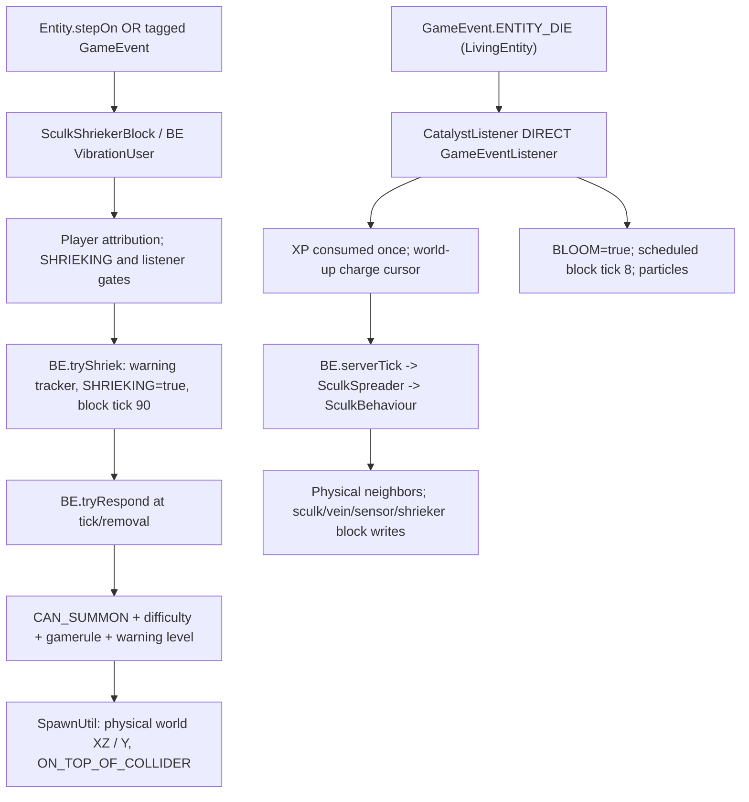

# Stage 3A-8.3 — sculk shrieker/catalyst six-face source-to-world contract and proposed acceptance fixtures

**2026-10-10 · branch `2.0` · Minecraft `1.21.1` / NeoForge `21.1.215` / Java 21.**
**Scope:** two exact registered BLOCK IDs: `minecraft:sculk_shrieker` (class `SculkShriekerBlock`) and `minecraft:sculk_catalyst` (`SculkCatalystBlock`), plus the necessary *non-counted* BE, growth and feature owners. Both BLOCK class+compiled declaration and their ITEM creators were covered in [3A-8.1](PHASE2_STAGE3A_SCULK_SHRIEKER_CATALYST_SOURCE_OWNER_AUDIT_1_21_1.md) and [3A-8.2](PHASE2_STAGE3A_SCULK_SHRIEKER_CATALYST_ITEM_WORLDGEN_ALTERNATE_AUTHORS_1_21_1.md).

**This document specifies SOURCE-EVIDENCED invariants and FUTURE runtime tests, NOT their results.** No Minecraft/NeoForge patched ASM analysis, application of Planet Mixins, Java code changes, CI/client/server/gameplay PASS, or successful Warden spawning/worldgen is claimed. Source evidence: pinned [comparative Minecraft Java 1.21.1 revision](https://github.com/hackersense/OptiFine-Source/tree/b77c5c6995874f6cf2755bc5234428906b337b75/1.21.1), **not** decompiled NeoForge patch bodies; original 21.1.215 registry ZIP artifact 11643813158 and digest `7937deee9221c2032a634d8355b8118b47efd9d905b2bb64152148c0174d090e` previously independently checked. Planet-specific integration statements are **contracts/proposals**, not observed execution.

## 1. Two fundamentally distinct event and mutation pipelines

There is **no universal sculk `VibrationSystem.Listener` adapter**: shrieker BE uses `VibrationSystem` with travel/occlusion; catalyst BE uses its own `CatalystListener` with `BY_DISTANCE` dispatch. Catalyst **BE server tick** progresses charge; **block scheduled tick** resets BLOOM. Shrieker has its own **BE VibrationSystem ticker**, **90-tick scheduled block callback**, and immediate `onRemove` response path.

### Source-owned callbacks

| Declaring semantic owner | Original source fact | Phase |
|---|---|---|
| [`SculkShriekerBlock`](https://github.com/hackersense/OptiFine-Source/blob/b77c5c6995874f6cf2755bc5234428906b337b75/1.21.1/net/minecraft/world/level/block/SculkShriekerBlock.java#L32-L180) | `COLLIDER = box(0,0,0,16,8,16)`, `stepOn`, `updateShape` water tick, `getFluidState`, `tick` SHRIEKING reset, `onRemove` response | Phase 2 block, Phase 3 collision/occlusion, Phase 5 water |
| [`SculkShriekerBlockEntity`](https://github.com/hackersense/OptiFine-Source/blob/b77c5c6995874f6cf2755bc5234428906b337b75/1.21.1/net/minecraft/world/level/block/entity/SculkShriekerBlockEntity.java#L160-L294) | `VibrationUser` radius 8; `requiresAdjacentChunksToBeTicking=true`; warning state and GameEvent; 90 ticks; `SpawnUtil` request | Phase 7A listener/ticks, Phase 7/entity spawn |
| [`SpawnUtil`](https://github.com/hackersense/OptiFine-Source/blob/b77c5c6995874f6cf2755bc5234428906b337b75/1.21.1/net/minecraft/util/SpawnUtil.java#L19-L105) | Spawn iterations sample X/Z offsets; move **world DOWN**, return world UP; `ON_TOP_OF_COLLIDER` requires physical shape full on **world UP** | Entity/spawn world boundary; not Phase 2 rotation of arbitrary world vectors |
| [`SculkCatalystBlockEntity`](https://github.com/hackersense/OptiFine-Source/blob/b77c5c6995874f6cf2755bc5234428906b337b75/1.21.1/net/minecraft/world/level/block/entity/SculkCatalystBlockEntity.java#L29-L146) | `CatalystListener` radius 8, `ENTITY_DIE`, XP gate; world-UP 0.5 charge origin; server-tick cursor; world Y+1.15 SCULK_SOUL; 8 tick bloom | Phase 7A event/BE, Phase 3 particle |
| [`SculkSpreader`](https://github.com/hackersense/OptiFine-Source/blob/b77c5c6995874f6cf2755bc5234428906b337b75/1.21.1/net/minecraft/world/level/block/SculkSpreader.java#L163-L450) | 32 max cursors, physical `BlockPos` charge keys, non-corner 18-neighbor candidate list, physical clearance/substrate graph | Phase 2 block topology; Phase 8/9 worldgen spread |
| [`SculkBlock`](https://github.com/hackersense/OptiFine-Source/blob/b77c5c6995874f6cf2755bc5234428906b337b75/1.21.1/net/minecraft/world/level/block/SculkBlock.java#L30-L123) / [`SculkPatchFeature`](https://github.com/hackersense/OptiFine-Source/blob/b77c5c6995874f6cf2755bc5234428906b337b75/1.21.1/net/minecraft/world/level/levelgen/feature/SculkPatchFeature.java#L23-L94) | `pos.above()` direct growth, physical density 9×3×9 window, feature physical BELOW/XZ and support; possible direct CAN_SUMMON=true author | Phase 2/8/9 source direction and worldgen target |

## 2. Coordinate domains and adapter selection — no blanket rotation

| Domain | Keep invariant | Proposal, not implemented/verified |
|---|---|---|
| Physical world `BlockPos` | Actual vanilla cell, network ID, BE key, cursor and `setBlock` target; **one cell at seam or corner** | `PlanetBlockStateFrame.resolve` selects one canonical face at a physical cell; do NOT create six virtual block copies |
| Canonical BlockState frame | For each physical block, deterministic local UP/tangents; `SculkShriekerBlock` and `SculkCatalystBlock` have **no FACING property** | Use canonical frame for half-height shape, any block-local support/up predicate and block-semantic direction |
| Traversal chart | Path/entry dependent direction transport is permitted, **not** persistent block identity | `PlanetBlockFrameContext.step` / `PlanetBlockNeighborQuery` only when intentional ordered local neighbor traversal is needed |
| Physical events and listener `Vec3` | GameEvent emitter/receiver coordinates, Euclidean distance, ray occlusion remain actual XYZ | Keep vibration listener physical, including across geometric gravity seams |
| Physical chunk coordinates | Minecraft chunk X/Z addressing is **never** reinterpreted as face-local chunk addressing | Listener tick gate must inspect loaded/ticking physical neighboring chunks |
| Worldgen sampling | Planet generation chart determines local cave/surface; actual `WorldGenLevel` writes a physical cell | Adapt physical target and local normal at a **feature/generation boundary**, not via global replacement of `Direction.UP/DOWN` |
| Warden mob/spawn placement | Entities and AABBs are placed in actual world; spawn search policy has gravity-local surface meaning | Phase 7/entity-spawn owner should adapt suitable support search while preserving actual coordinates, spawn rules and height/border checks; **not** inject blanket `SpawnUtil` rotation |

Current committed Planet-specific helpers (inspected at branch HEAD before this research):
[`PlanetFace`](https://github.com/Abbygree11/Planetary/blob/2.0/src/main/java/dev/planetary/topology/PlanetFace.java),
[`PlanetBlockStateFrame`](https://github.com/Abbygree11/Planetary/blob/2.0/src/main/java/dev/planetary/world/PlanetBlockStateFrame.java),
[`PlanetBlockFrameContext`](https://github.com/Abbygree11/Planetary/blob/2.0/src/main/java/dev/planetary/world/PlanetBlockFrameContext.java),
[`PlanetBlockNeighborQuery`](https://github.com/Abbygree11/Planetary/blob/2.0/src/main/java/dev/planetary/world/PlanetBlockNeighborQuery.java),
[`PlanetBlockRuntime`](https://github.com/Abbygree11/Planetary/blob/2.0/src/main/java/dev/planetary/world/PlanetBlockRuntime.java), and
[`PlanetBlockShapeRuntime`](https://github.com/Abbygree11/Planetary/blob/2.0/src/main/java/dev/planetary/world/PlanetBlockShapeRuntime.java).
These existing helpers are **not evidence they already intercept the sculk call paths**.

## 3. Exact six-face basis and invariants

Use canonical source face for normal/tangent semantics. `PlanetFace` was inspected; values match prior [3A-7.3 calibrated-sensor chart](PHASE2_STAGE3A_SCULK_SIX_FACE_VIBRATION_SIGNAL_CONTRACT_1_21_1.md). Physical space remains **single global XYZ**.

| Canonical face | local UP → world | local EAST → world | local SOUTH → world | local DOWN → world |
|---|---|---|---|---|
| `POS_Y` | +Y | +X | +Z | −Y |
| `NEG_Y` | −Y | +X | −Z | +Y |
| `POS_X` | +X | −Y | +Z | −X |
| `NEG_X` | −X | +Y | +Z | +X |
| `POS_Z` | +Z | +X | −Y | −Z |
| `NEG_Z` | −Z | −X | −Y | +Z |

**Interior invariant:** shrieker collider (0..16 tangents; local Y 0..8) protrudes **toward local UP** on each face; source support below is local DOWN. Catalyst has no orientation BlockState property and **does not** inherit shrieker's half-height collider or WATERLOGGED. This is a *shape integration test requirement*, not an assertion that its generic collision is already gravity-aware.

**Seam invariant:** two traversal entry faces may differ but `PlanetBlockStateFrame.resolve(field, physicalPos)` must return one chosen canonical BlockState face. For one physical cell there must be **one BlockState, one BE, one listener registration and at most one applicable block-scheduled state reset**, not one per chart. `crossedTraversalBoundary` must not cause an alias `BlockPos` or synthesize duplicate event/spreader charge. All `setBlock` targets/charge cursor positions remain actual cells.

**Corner invariant:** reach a 3-face junction along at least two different traversal paths. The final *physical* `BlockPos` and canonical frame agree for both, even if transport histories differ. Adjacent support checks must be based on actual appropriate source/target frame and physical sturdy face, **never** merely reuse source-local UP as world UP at the target.

**Non-Planet invariant:** `PlanetBlockRuntime.fieldAt` empty => no adaptations; vanilla shape, SpawnUtil, events, worldgen and ITEM behavior unchanged.

## 4. Shrieker: collision, input, warning, timer and Warden physical spawn

### 4.1 Two triggers, one BE, no phantom duplicate

[SculkShriekerBlock.stepOn](https://github.com/hackersense/OptiFine-Source/blob/b77c5c6995874f6cf2755bc5234428906b337b75/1.21.1/net/minecraft/world/level/block/SculkShriekerBlock.java#L68-L80) resolves eligible `ServerPlayer` directly or via riding/projectile/item ownership; calls `BE.tryShriek`. In parallel [SculkShriekerBlockEntity.VibrationUser](https://github.com/hackersense/OptiFine-Source/blob/b77c5c6995874f6cf2755bc5234428906b337b75/1.21.1/net/minecraft/world/level/block/entity/SculkShriekerBlockEntity.java#L241-L293) accepts `GameEventTags.SHRIEKER_CAN_LISTEN` via the shared `VibrationSystem`, requiring source attribution to a player and not currently `SHRIEKING`. Radius 8; its BE requires adjacent chunks to be ticking. The listener uses **physical world-event source/receiver** and delayed delivery; do **not** fold the ray along Planet's tangent seam or make `stepOn` dispatch a second artificial block event. A single eligible simultaneous scenario must never yield two warnings as a result of a Planet adapter; count both entrypoints to locate the culprit if it does.

### 4.2 Warning vs response vs actual spawn

[`tryShriek`](https://github.com/hackersense/OptiFine-Source/blob/b77c5c6995874f6cf2755bc5234428906b337b75/1.21.1/net/minecraft/world/level/block/entity/SculkShriekerBlockEntity.java#L160-L193) writes `SHRIEKING=true` and schedules **90 block ticks** when its gate succeeds, sends level event/GameEvent.SHRIEK. Separate [`SculkShriekerBlock.tick`](https://github.com/hackersense/OptiFine-Source/blob/b77c5c6995874f6cf2755bc5234428906b337b75/1.21.1/net/minecraft/world/level/block/SculkShriekerBlock.java#L94-L102) clears state and invokes BE response. `onRemove` also asks the BE to respond *if replacing a currently shrieking block*; it is a **different callback**, not a second scheduled tick. Preserve vanilla response conditions and prevent accidental double response due to added Planet callbacks.

[`canRespond`](https://github.com/hackersense/OptiFine-Source/blob/b77c5c6995874f6cf2755bc5234428906b337b75/1.21.1/net/minecraft/world/level/block/entity/SculkShriekerBlockEntity.java#L195-L233) requires `CAN_SUMMON`, not PEACEFUL, and `RULE_DO_WARDEN_SPAWNING`. `WardenSpawnTracker.tryWarn` can supply warningLevel; `trySummonWarden` only attempts spawn at warningLevel **>=4**; even then `SpawnUtil.trySpawnMob` may return empty because world support, obstruction or spawn checks reject the candidate. **Do not equate SHRIEKING with Warden summoned**.

**Critical source exactness correction:** [`SpawnUtil.trySpawnMob`](https://github.com/hackersense/OptiFine-Source/blob/b77c5c6995874f6cf2755bc5234428906b337b75/1.21.1/net/minecraft/util/SpawnUtil.java#L19-L105) called with **20 attempts, horizontal offset radius 5 and vertical search range parameter 6**. It initially offsets physical XZ, sets physical Y+6, searches by repeated **Direction.DOWN**, then requires `ON_TOP_OF_COLLIDER`: collision-free target and **Block.isFaceFull(..., Direction.UP)** on the support block. The API uses *world XZ and world Y*, **not** local-up. Future local-surface spawn policy belongs to the Phase-7 entity/world spawn boundary. Do **not** rotate the `BlockPos` of the shrieker, the world-border test, or Warden entity location a second time.

### 4.3 State, fluid and geometry

`SHRIEKING` and `CAN_SUMMON` are Boolean state properties, not physical direction properties. `WATERLOGGED` derives from target **physical fluid** on normal item placement; [`updateShape`](https://github.com/hackersense/OptiFine-Source/blob/b77c5c6995874f6cf2755bc5234428906b337b75/1.21.1/net/minecraft/world/level/block/SculkShriekerBlock.java#L135-L159) schedules a WATER **fluid tick**, distinct from 90-tick **block tick** and the **BE `VibrationSystem.Ticker`**. `getCollisionShape` and `getOcclusionShape` use a half-block 8/16-high **canonical-local** `VoxelShape`: validate outermost physical shape rotation once and ensure no double-rotation/Light occlusion regressions. Placement with optional `DataComponents.BLOCK_STATE` may override valid properties, while generation / template may author state without `BlockItem`.

## 5. Catalyst: direct ENTITY_DIE event, XP, cursors, tick, particle

[`SculkCatalystBlockEntity.CatalystListener`](https://github.com/hackersense/OptiFine-Source/blob/b77c5c6995874f6cf2755bc5234428906b337b75/1.21.1/net/minecraft/world/level/block/entity/SculkCatalystBlockEntity.java#L63-L147) uses **direct** `GameEventListener`, radius 8, `BY_DISTANCE`; it accepts `ENTITY_DIE` only if source is a LivingEntity and exp not yet consumed. If eligible experience reward positive, it seeds `SculkSpreader.addCursors(BlockPos.containing(eventVec3.relative(Direction.UP,0.5)), xp)`. **That 0.5 offset is physical world UP in vanilla**, distinct from block support semantics; Planet adaptation must decide if the seed intends entity-local outward/up placement, and test source coordinate vs converted result **without rewriting `GameEvent` itself**. Call to `skipDropExperience` ensures the death event cannot independently award same XP as dropped or sculk charge. Normal vanilla eligibility restrictions still apply.

Independently, catalyst `bloom` writes `BLOOM=true`, schedules a **relative 8-tick block reset**, sends `SCULK_SOUL` particles at world (`x+0.5, y+1.15, z+0.5`), and sound. [`SculkCatalystBlock.tick`](https://github.com/hackersense/OptiFine-Source/blob/b77c5c6995874f6cf2755bc5234428906b337b75/1.21.1/net/minecraft/world/level/block/SculkCatalystBlock.java#L46-L53) resets the bloom bit, but [`SculkCatalystBlockEntity.serverTick`](https://github.com/hackersense/OptiFine-Source/blob/b77c5c6995874f6cf2755bc5234428906b337b75/1.21.1/net/minecraft/world/level/block/entity/SculkCatalystBlockEntity.java#L33-L55) updates cursors every server BE tick **not every 8 ticks**. BE stores `cursors` in NBT; reloading must not replay death/XPs. Particle emission requires a **Phase 3 local visual emitter decision**; world Y+1.15 is not silently local UP on ±X/±Z/−Y. Catalyst **has no WATERLOGGED property**.

## 6. Sc​​ulk growth / feature targeting: 18 neighbors, no phantom corner cell

[`SculkSpreader.ChargeCursor.NON_CORNER_NEIGHBOURS`](https://github.com/hackersense/OptiFine-Source/blob/b77c5c6995874f6cf2755bc5234428906b337b75/1.21.1/net/minecraft/world/level/block/SculkSpreader.java#L225-L235) is exactly **18 physical offsets** from {-1,0,+1}³ excluding the origin and 8 offsets where **all three axes are nonzero**: 6 axial + 12 two-axis offsets. This is **not** six face ports, not a local-4-neighbor walk, and not “the three-face Planet corner” — these are different notions of corner. [`getValidMovementPos`](https://github.com/hackersense/OptiFine-Source/blob/b77c5c6995874f6cf2755bc5234428906b337b75/1.21.1/net/minecraft/world/level/block/SculkSpreader.java#L382-L448) tests real physical target cells, SculkBehaviour and substrate access; for two-axis movement `isMovementUnobstructed` evaluates intermediate physical face sturdiness via alternatives. **The random candidate order and obstruction decisions matter; replacing by unconditional rotated cardinal neighbors is incorrect.**

[`SculkSpreader.updateCursors`](https://github.com/hackersense/OptiFine-Source/blob/b77c5c6995874f6cf2755bc5234428906b337b75/1.21.1/net/minecraft/world/level/block/SculkSpreader.java#L163-L221) keys charge aggregation by **physical BlockPos**, max **32** active cursors, and differs in worldgen vs level merge policy. When adapting locally, *final physical target* (not face atlas/chart) must be the identity key; two transported paths to the same physical cell cannot generate two world copies or drop/clone charge.

The [`SculkVeinBlock / MultifaceSpreader`](PHASE2_STAGE3A_SCULK_SHRIEKER_CATALYST_SOURCE_OWNER_AUDIT_1_21_1.md) face/substrate graph may write directional attached BlockStates, replace source blocks, remove faces or produce AIR/WATER; the **target block's canonical state frame** is required when deciding a support side. Merely studying this graph does **not** promote the `SculkVeinBlock` registered class in the 241-class ledger.

[`SculkBlock.attemptUseCharge`](https://github.com/hackersense/OptiFine-Source/blob/b77c5c6995874f6cf2755bc5234428906b337b75/1.21.1/net/minecraft/world/level/block/SculkBlock.java#L30-L123) uses world `pos.above()`, physical density volume (`dx=-4..4,dy=0..2,dz=-4..4`) and direct `setBlock` of sensor/shrieker; for shrieker `CAN_SUMMON` is derived from spreader's `isWorldGeneration`. Feature [`SculkPatchFeature.place`](https://github.com/hackersense/OptiFine-Source/blob/b77c5c6995874f6cf2755bc5234428906b337b75/1.21.1/net/minecraft/world/level/levelgen/feature/SculkPatchFeature.java#L23-L94) separately writes a catalyst at origin if world `below()` full collider and chance, and optional shrieker at physical XZ ±2 offset with `below().isFaceSturdy(...,UP)`, with `CAN_SUMMON=true`. Two [`CaveFeatures` configurations](https://github.com/hackersense/OptiFine-Source/blob/b77c5c6995874f6cf2755bc5234428906b337b75/1.21.1/net/minecraft/data/worldgen/features/CaveFeatures.java#L471-L472): deep-dark `extraRareGrowths=0`, ancient-city `1..3`, both `catalystChance=0.5` subject to support and feature eligibility. These hard-coded world-XZ/down assumptions require **Phase 8/9 feature-local orientation policy**, not a blanket global direction patch. Generic `StructureTemplate` state/BE placement remains an independent direct author; no shipped NBT palette asserted.

**Boundary decision before implementation:** preserve the *actual 18 world-cell candidates and physical collision tests* when the algorithm is explicitly world topology, while designing intentional Planet-local growth/support rules only at identified source/feature adapters. At a seam/corner evaluate chart transport and target canonical frame, enforce physical-cell deduplication, and compare against vanilla control. Do not predeclare that all 18 candidates must be rotated at every block or that every world axis occurrence should become local.

## 7. Proposed executable acceptance matrix (ALL NOT RUN)

Fixture layers: (a) vanilla no-gravity control in normal Overworld; (b) Planet `POS_Y` control; (c) each of all **six** face interiors with same physical-distance events; (d) each of 12 face edges and 8 cube triple-face corners when representative cells exist at selected shell radius; (e) real world X/Z chunk seams and loaded/unloaded cases; (f) item, direct feature, sculk charge growth, artificial serialized structure fixture. All paths must record physical source/target identity.

| Test | Exact setup/action | Expected assertion / owning phase |
|---|---|---|
| **SC8-01** | Normal non-Planet world: ordinary shrieker and catalyst BlockItem, then natural tagged game event and a living death event | Baseline `CAN_SUMMON=false`, `SHRIEKING=false`, `BLOOM=false`; correct BE types and vanilla event semantics; no Planet adapter (2/7A) |
| **SC8-02** | For each of 6 Planet face interiors, place both blocks with real player item/useOn | Exactly 1 physical BLOCK ID + BE each, same normal default state (shrieker WATERLOGGED by fluid), no accidental FACING; no ghost block (2) |
| **SC8-03** | Six interiors × shrieker collision/occlusion and grounded entity step | 8/16 slab protrudes local UP with physical shape **rotated once**, light-occlusion consistent; observe actual side/ceiling `stepOn` callback (3, 7A) |
| **SC8-04** | Each face × explicit player stepping on shrieker vs player-attributed valid tagged GameEvent separately | Both eligible paths invoke correct BE logic; one distinct trigger action, no synthesized duplicate event or warning; physical event location preserved (7A/2) |
| **SC8-05** | Tagged `GameEvent` emitted at world Euclidean distances just inside/outside radius 8; matched physical occluded vs open ray | Listener eligibility governed by physical radius and `VibrationSystem` occlusion/travel; no gravity-chart ray folding (7A) |
| **SC8-06** | Shrieker at physical X/Z chunk ticking border, stop a required adjacent chunk then resume | `requiresAdjacentChunksToBeTicking=true` gate honored; no cross-face chunk-coordinate fiction, no duplicate delayed vibration (7A) |
| **SC8-07** | Each face normal plain `CAN_SUMMON=false`; separately `DataComponents.BLOCK_STATE` or fixture state `CAN_SUMMON=true` | Plain item not summoning; explicit legal override retained if engine allows; no illegal write or invented per-face FACING (2/7A) |
| **SC8-08** | Valid shriek on six faces, sample state before, at and after **90 scheduled block ticks** | `SHRIEKING` true and reset by scheduled **block** tick, not BE tick, not randomTick; warning state and game event do not double fire (7A) |
| **SC8-09** | Repeat shrieker with PEACEFUL / gamerule disabled / CAN_SUMMON=false / CAN_SUMMON=true, warningLevel below vs ≥4 | Distinguish shriek, Warden warning, response and spawn attempts; disabled gates block response; summon not guaranteed even with warning≥4 (7A/7) |
| **SC8-10** | For each face, especially NEG_Y and ±X/±Z, construct local-flat valid Warden surface; trigger eligible `trySummonWarden` | Trace **20 tries**, XZ radius 5, world-Y search range 6 and world-UP collider rejection in vanilla; require future local-surface Phase-7 spawn policy without changing unrelated SpawnUtil callers; no claim of current success (7) |
| **SC8-11** | Trigger shriek then remove block before 90-tick scheduled response; separately leave block to tick | `onRemove` and scheduled tick each correct, **no double response or orphan BE**; no stale callback for missing block (7A) |
| **SC8-12** | Save/unload/reload shrieker BE with pending vibration/warning; re-open all required physical chunks | Listener and `warning_level` serialized, resumes appropriately without double shriek or duplicated warning; physical BE position unchanged (7A) |
| **SC8-13** | Six faces × living entity death within catalyst radius 8; control outside 8, duplicate death event, non-Living source and XP-ineligible death | Exactly one valid `CatalystListener` handling, eligible XP converted once to charge, no duplicate XP drop, independent of VibrationSystem; invalid events no new charge (7A) |
| **SC8-14** | Place death event at known fractional physical XYZ on POS_Y, ±X, ±Z and NEG_Y with physical/local UP differing | Trace `BlockPos.containing(eventVec3 + worldUP·0.5)` vanilla seed; future intended source-local seed uses explicit policy, while GameEvent Vec3 remains unmodified; no phantom cell (7A/2) |
| **SC8-15** | Trigger catalyst BLOOM then advance exactly **8** scheduled block ticks and BE server ticks independently | BLOOM reset at block tick; cursor continues per BE server tick; only intended particles/sound; no duplicate tick registrations (7A/3) |
| **SC8-16** | Save/reload catalyst BE with nonempty sculk charge, then continue until decay/spread | `cursors` NBT persisted within max-32 bound; real physical BlockPos recovered; no charge cloning across seam or double XP (7A/2/8) |
| **SC8-17** | Controlled 18-offset SculkSpreader fixture, separate 6 axial / 12 two-axis candidates / 8 three-axis excluded cube corners | Exact source candidate-set contract, isMovementUnobstructed intermediate solidity, randomized order under fixed seed; distinguish physical cube-corner concept (2/8) |
| **SC8-18** | All six faces × level sculk charge growth adjacent to air/water, compare local-up surface to actual vanilla world-above cell | The selected growth cell is physically unique, WATERLOGGED property comes from actual target fluid; document deviations pending local-up policy; no blind `pos.above()` (2/5/8) |
| **SC8-19** | Every selected edge × charge cursor from each side of seam; compare two traversal paths to same physical position | Correct target canonical state/support face, no duplicate physical cell or charge, no broken tangent continuity; never create face-atlas aliases (2/8) |
| **SC8-20** | Each triple-face corner × two/three approach paths with sensor/shrieker/vein growth | Same final physical cell, one canonical state/BE and listener, physical-cursor aggregation and legal face attachments, no self-loop/fantom copy (2/8) |
| **SC8-21** | Controlled `SculkPatchFeature` runs on six local surface interiors and edges using reproducible seeds; compare deep-dark vs ancient-city configs | Catalyst direct writer uses supported target; rare shrieker true; deep-dark zero extra-rare attempts vs ancient-city 1..3; worldgen spread differs from level spread (8/9) |
| **SC8-22** | Synthetic structure template with each of two states and BE NBT; rotate/mirror, use WorldGenLevel direct writer fixture | Saved legal `CAN_SUMMON/BLOOM`, BE data retained as permitted, no item-only callback requirement; do **not** claim vanilla ships that template (8/9/2) |
| **SC8-23** | Shrieker six faces with WATERLOGGED on/off and neighboring water ticks; catalyst equivalent fluid-placement control | Shrieker `getFluidState` and WATER scheduled fluid tick, half-shape solid/contact; catalyst never gains WATERLOGGED, local flow belongs to Phase 5 (2/5) |
| **SC8-24** | Six face bloom particle emitter + vanilla control, screen capture with known local UP normal | Source world Y+1.15 emission documented; client emitter orientation/presentation must be intentional on side/down faces, no double client emission; Phase 3 acceptance only after actual run (3) |
| **SC8-25** | Forced unloaded chunk across actual physical X/Z boundaries while charge, BE listener and scheduled state resets active; save/restart server | Real chunk addressing/ticks and BE persistence, no spurious global-coordinate graph walk, no duplicate charge/response or orphan state (7A/8) |
| **SC8-26** | Launch no-Planet Overworld with Planetary installed; ordinary sculk worldgen, SculkPatchFeature seed controls and both BlockItem paths | Bit-for-bit expected vanilla BlockState and source semantics where deterministic, no global `UP` modification, no performance blowup (2/8/9) |

**Test log schema / evidence requirements:** test ID, actual Minecraft/NeoForge version, commit hash and Mixin applied yes/no, world type, deterministic random seed, biome/feature, exact physical `BlockPos` and `Vec3`, canonical `PlanetFace`, local UP to world direction, traversal entry face/step target, actual inspected physical neighbors, chunk `(x>>4,z>>4)` ticking set, source owner/entrypoint (item, component, GameEvent, BE tick, scheduled block tick, SculkSpreader, feature, template), before/after `CAN_SUMMON, SHRIEKING, WATERLOGGED, BLOOM`, BE type/NBT/warning level/cursor positions, XP/experience-consumed flag, emitted event count, particle XYZ, spawn attempt candidate/support diagnostics, expected vs actual result and per-phase verdict. Distinguish **test harness fixture state** from normal player placement or vanilla-generated assets.

## 8. Gates, outstanding decisions and durable status

**Unresolved implementation decisions must remain explicit:**
1. Whether **catalyst charge cursor seed** world-UP+0.5 should adapt to source entity local UP or to the catalyst's canonical frame, and exact semantics for entity death near a seam (Phase 7A/2). Source alone does not establish this Planet product policy.
2. Where **warden local support/vertical search** should be adapted without globally changing `SpawnUtil` (Phase 7/entity integration); entity AI/collision acceptance independent of spawning.
3. How **SculkPatchFeature origin, XZ offsets, support and density volume** transform from one continuous Planet-generation chart into physical space across seams/corners (Phase 8/9). Do not generate six disconnected copies.
4. How sculk **18 physical neighbor candidates** and `SculkVein` face attachment should interact with local traversal at a seam: preserve actual world-cell identity and obstruction, define intentional local growth semantics, do not blindly rotate every direction.
5. Whether client `SCULK_SOUL` offset should become local block UP even when server world event remains physical; Phase 3 emitter must own that visual transformation.
6. Require NeoForge compiled ASM/dispatcher evidence, applied Mixin and actual client/server tests before changing any acceptance field.

**Status accounting unchanged** from 3A-8.2: original **73/241 concrete BLOCK classes** source + compiled nearest method-declaring owners reviewed, covering **194/1060 BLOCK IDs**; **168/241** classes (**866 IDs**) still source REVIEW_PENDING. All **241** NeoForge patched-bytecode, Planet adapter acceptance and gameplay acceptance fields **REVIEW_PENDING**. **3A-8.4 ledger clarification:** neither `SculkBlock` nor `SculkVeinBlock` was newly promoted by this packet, but their pre-existing statuses DIFFER: `SculkBlock` is `REVIEW_PENDING`; `SculkVeinBlock` was already `SOURCE_REVIEWED_INTEGRATION_PENDING` from the earlier Stage 3A graph cohort and is among these existing 73. See [independent 3A-8.4 reconciliation](PHASE2_STAGE3A_SCULK_SHRIEKER_CATALYST_ORIGINAL_73_CLASS_RECONCILIATION_1_21_1.md). No ledger counts change. This stage does NOT edit ledger or runtime code.

**NEXT first unchecked `3A-8.4`** in [02f task card](../phases/phase-02/02f-sculk-shrieker-catalyst-owners.md): independently reparse immutable NeoForge 21.1.215 ZIP for all 241 classes, reconcile current 73 reviewed/194 exact IDs and five declaring owners each, check all outstanding fields, prepare next family card, make ONE docs-only commit and STOP. Stage 3A and Phase 2 remain OPEN.
